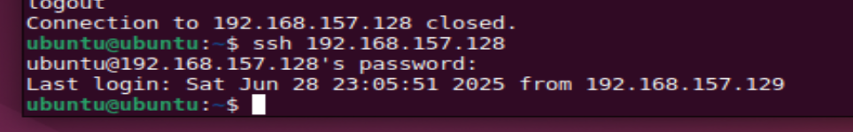

# BRG-27-labs
## Day 1: Setting Up and Exploring Linux

On the first day of class, I was a bit nervous as I've never learned in depth about servers and virtual machines (VM) or even worked with Linux before. I already had a GitHub account prior to class starting. During the introduction Mr. Yatim gave about servers and VMs and how it worked as well as all the buzz words used, I found myself overwhelmed with the sheer amount of things I had no knowlegde on. Slowly, with more explanation from Mr. Yatim, I was able to understand more about the things he was talking about. Of course, there are still a bunch of things that I will need to read up on and learn but I know that with the resources he had provided, I will be able to gain the knowlege to learn everything I can.

Setting up VMware, VirtualBox and downloading Ubuntu was also a struggle as I kept hitting errors. From being prompted about missing dependencies, to struggling with the downloading of VMware, and the the nail in the coffin, unable to run the VM once everything was downloaded. It required me to update my BIOS to enable AMD-V, something I've never done or even heard of. A quick Google search later, I was finally able to run my VM.

### Lab - Familiarity with Ubuntu Linux
 I can see that when I write the command `ls`, it is showing just the main files without any hidden files. However, the command `ls -la` shows all the files including the hidden files in the directory. I found out that `-l` actually stands for long format which is why it is showing extra details such as size, modification time etc.

There are some differences I can see while testing `gedit` and `nano`. For `gedit`, it is a graphical text editor that opens up another interface that looked similar to Notepad on Windows while `nano` was entirely done in the terminal itself. Using `gedit` also required me to install a few things to run it such as `gnome-46-2404` and `gedit`.
 gedit: 
 nano: 

Next, I followed the steps to learn how to use the hosts files to add IP addresses into the hosts file. I realised that this would be good for when I frequent these IPs. From the lab, I also learned how to view and edit the different hosts on `/etc/hosts`.  
 

The last thing that I saw a big difference in is when I ran the command `less hello_world.c` and `less hello_world_executable`.  For `hello_world.c`, I can read the actual C source code. It's interesting to see how the computer reads our source code after it has been compiled into binary. I used to think that it's just reading our code, line by line, but I failed to realise that compiling my code would turn it into something totally unreadable by me. 

### Lab - Linux Services
Working with two virtual machines for this portion of the lab. During the portion where I had to enable the Ubuntu Firewall (UFW) on one of the clone, it was interesting to see that the difference in the output after it had been enabled. Initially, I was able to see the open ports on the first clone without any issue. However, after enabling the UFW, the firewall was immediately blocking the ping requests from the second clone.
 

#### Challenge 1
>Can you ssh into your neighbour's machine? Once you have logged into your neighbour's machine, see if you can create a text file on their desktop saying Hi_[neighborsname]

I first started by logging into my clone VM bt using `ssh [ip_address]`. It prompted me for the password before it allowed me to log in.

And then with a quick command of `touch hi_vm1.txt`, I have successfully created a new text file in my first clone! 

#### Challenge 2

#### Challenge 3
STRUGGLING! A WHOLE LOT.

#### Challenge 4

## Day 2: Services, Cost, and Scripting

### 2a-1 Total Cost of Ownership (TCO) Analysis.
Before this lab activity, I wasn't fully aware about the concept of Total Cost of Ownership (TCO). This activity showed me how important it is to factor in long-term expenses like consumables, electricity, and maintenance.

I compared two printers: the Canon PIXMA MG3620 (inkjet) for the budget, home use and the Brother DCP-L2640DW (laser) which is more suitable for office use. The Canon printer was cheaper to buy initially `($119 vs $278)`, but it had a much higher TCO - `$77,353` over 5 years. This is due to the low-yield ink cartridges which was the true bulk of the price. The total price on just ink cartridges alone would be `$69,350`.

In comparison, while more expensive in the initial stage, the Brother had a TCO of just `$17,042` and it is all thanks to the more efficient toner and drum system. The toner itself had a yield of 3000-pages compared to the low yield of 180-pages and 400-pages for the black ink and color cartridges respectively. Over the 5 year period with an estimate of 180,000 pages, the Brother prints each page at a meagre price of `$0.09` while the Canon is `$0.43`. Thanks to the toner and drum system, there is a total savings of `$60,311`.

This exercise helped me to see how misleading low upfront costs can be and how essential it is to calculate long-term costs especially when it comes to making IT procurement decisions. While the Canon printer seems cheaper at the beginning, it ends up being over four times more expensive in the long run due to its inefficient ink system.

### 2b-1 Cloud Web Server Deployment with Amazon EC2

#### Challenge 1
For this challenge, I ran a quick test using the command `ping [website]` on a few websites to check their latency:  google.com, gov.sg, bbc.co.uk, sydney.edu.au, mit.edu, japan.go.jp. I chose these because I wanted to see how the physical distance between where I am  (Singapore) and where their websites' servers are likely located will affect how fast they respond.

As expected, the fastest connections were from Singapore and Japan. Google was also really fast as they have servers in Singapore. The slowest turned out to be from sydney.edu.au, which was expected due to the physical distance from Singapore. 

However, I was actually surprised to see how quickly bbc.co.uk and mit.edu responded. I was expecting it to have a similar latency to sydney.edu.au since they are even further away. So I did a quick search and found out that for bbc.co.uk, they are actually making use of Content Deliveray Networks (CDNs), which helps to speed up content delivery, reduces load times and improves website performances. From my search, I learnt that CDNs stores copies of website contents on servers all around the world so that users can connect to a server that's near to them.

#### Challenge 2
For this challenge, I made use of Amazon EC2 to launch a new virtual machine in the cloud. It took a bit of tinkering around and searching around for help to get it up and running. I found that I was less overwhelmed than I was yesterday as I had picked up some of the keywords and concepts. Of course, there are still a lot more for me to learn when it comes to VM and cloud services but I'm confident that with time and more hands-on experience, I'll be able to build a more solid foundation that would help me during my time in Kaplan.

Once I had the EC2 instance running, I connected to it from my local using PowerShell via `ssh`. I did the necessary steps such as installing Apache2 and moved on to editing the index.html so that I could ensure my page was unique and that it was working. To do that, I used the command `sudo nano /var/www/html/index.html`.

At the start of this challenge, I was facing troubles as I was going about it all wrong. Since the file that I wanted to transfer into the VM is in my local folder, I was supposed to be using the local machine to run the `scp` command. However, I was trying to run the command in the VM itself which did not work as they couldn't find the file I was asking it to find. After a few failed attempts and reading through from forums, I realised that I needed to run the `scp` command from my local machine and not the VM. Once I did that, I was finally able to successfully transfer the file from local into the cloud instance. 

After succesfully transferring it into the VM, I was then stumped once again when I couldn't see the file that I've transferred. I had to look back at the steps provided in the challenge to see if there was a step that I had missed or maybe a command that I could use again. That's when I realised that I had to do one more step of moving the file into `/var/www/html/`. Once it was moved into the correct location, I was then able to edit the `index.html` and add a link to that file.

This experience was definitely challenging but I found it super rewarding. It forced me to troubleshoot, search for solutions, and really build my understanding of what is happening behind the scenes.

### 2b-2 Introduction to Bash Scripting & System Automation
For this lab, it was truly a hands-on experience with Bash scripting. Although, I had prior experience with Bash, it had been a while since I used it and this lab helped to refresh my memory and build a stronger foundation on it.

I first started by making a new folder called LabFiles by using the command `mkdir LabFiles`. Once I had `cd` into that folder, I made a new file and used `echo` to write content in that file. Since I used the redirect `>` command, it writes the text directly into the file instead of printing the words on my terminal. This is another way that I can change the content in a file instead of using the `nano` command which opens up a text editor.

After that, I moved on to the next part. I created `hello_world.sh` and in the first line I added the line `#!/bin/bash`. After searching what it stands for online, I learnt that it is called a `shebang` or `hashbang` line. It tells the system to run the script using the Bash shell. I used `chmod 777` to make the  script executable. This command sets the permissions for everyone to be able to read, write, and execute the file. For security reasons, it is often not recommended. `chmod +x` however, only changes the execute permission for the file. It does not change any existing read or write permissions. Once I had changed the permission, I was able to run the file. I did face a small issue but after editing my file, I was able to get it to print out the words `Hello, World!` properly.

Afterwards, I moved on to the move advance scripting portion of the lab. I first started with creating a `system_info.sh` file and proceeded to add in the code. It had a `for` loop that displays the five countdowns, a `read` to read user input and `if, elif, and else` statements to print different things based on the user's input. There was also a regex to validate if the user's input was a numeric value or not.

This showed me how scripts can be used to be interactive and to respond dynamically to different inputs. I also began to understand the importance of input validation, especially in real-world scripts that others would use.

The final part of the lab, I worked on a system monitoring script called `resource_monitor.sh`, which automates checking system resource usage. The script runs a loop based on the user input and displays information about the CPU, memory, and disk usage. It showed live system data by using the commands:
- `top -b -n1 | grep "Cpu(s)"`: for CPU usage
- `free -h`: for memory usage
- `df -h | grep "^/dev"`: for disk usage

This part of the script showed me how automation can be used to simplify monitoring tasks that could get mundane over time. Instead of manually running and using multiple commands, this script runs them all at once and displays it like a snapshot which can be very useful for admins or users who are managing servers. There are different ways I can see Bash scripting helping me in my future tasks. For example:
- `Automated Backups`: I could write a script to compress and copy important files weekly.
- `Scheduled system cleanups`: Automatically removing old temp files or freeing up disk space.

## Day 3: DNS, Certificates, and Automation

For today's lab activities, it was all about securing our web server with HTTPS using a free SSL certificate that I obtained from Let's Encrypt. Having a proper domain name with the secure padlock beside it made it feel legit. That is because I went from typing in the IP address of the server to a real website and url that was also secured.

#### 3a-1 Domain, DNS and TLS Certificates

Before I started working on getting the SSL certificate and turning my HTTP into HTTPS, I had to sort out the domain name. The few options listed in the lab required me to pay or input my credit card. Unwilling to do so, I sourced out other options I could use. At first I tried the Freenom and Dot.tk - but they kept throwing errors or just wouldn't load at all. I also tried applying for a GitHub Student Developer Pack as it provides free domain for up to a year, but that needed to be verified first. Eventually, I decided to go with DuckDNS, which was very simple to set up. I created the domain `iseabrdg.duckdns.org` and updated the IP address to point to my EC2 instance.

One small issue I ran into was that when I tried to open the domain in the browser, it didn't load immediately. I instantly thought that I had made a mistake. To double confirm that the domain was working, I used the `curl` command `(curl iseabrdg.duckdns.org)` as well as to `nslookup iseabrdg.duckdns.org` to confirm that the site was actually reachable. After a minute or two of constant reloading, to my relief the website started working. 

#### 3a-2 Enabling HTTPS with Let's Encrypt & Certbot

Once I had the domain pointing to my server and confirmed that it was accessible and running, I installed Certbot using the command `sudo apt install certbot python3-certbot-apache -y`. Once it was installed, I ran the command `sudo certbot --apache -d iseabrdg.duckdns.org`. The process of getting the SSL certificate was very smooth. It asked me a few questions and immediately after that, it had successfully deployed a certificate for my domain. I refreshed the page in my browser and was pleased to see that my domain had a padlock icon next to the URL which meant that the HTTPS certificate was live.

I also ran a dry-run renewal test using the command `sudo certbot renew --dry-run` just to see how the auto-renewal would work if I ever wanted to renew the SSL certificate.

From this lab activity, I have learnt that HTTPS is a must-have in this time and age, even for the most basic websites. Having your domain secured builds trust in the users that would use your website. I also enjoyed being able to use Let's Encrypt as it made obtaining SSL certificates super accessible. It is nice that it is free and renews automatically. I also learnt that having proper set up for both my EC2 and my DNS was crucial as it caused a small delay in my lab activities. With more hands-on work, I know it will be like second nature to me once I build more confidence. 

I can see myself using this setup again if I ever deployed a portfolio or a web project. Currently, all of my projects and portfolio are using Netlify or GitHub Pages. It would be nice to have my own domain and having it SSL certified. 