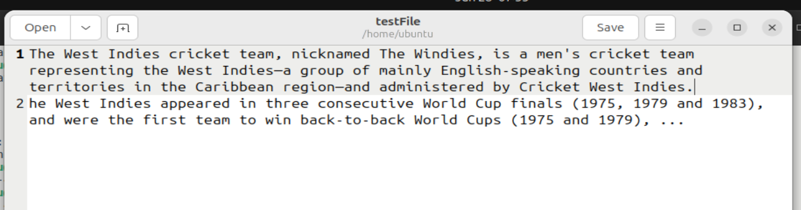
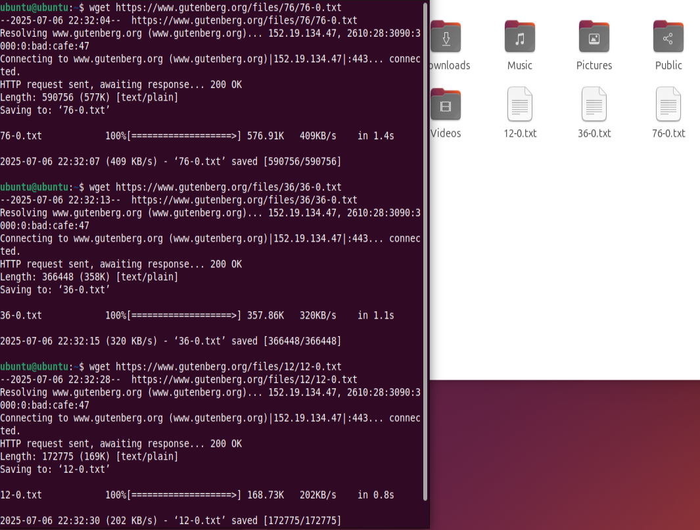
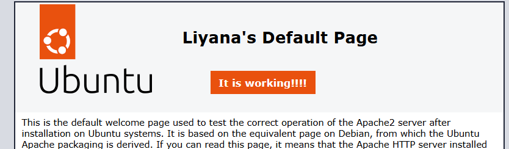
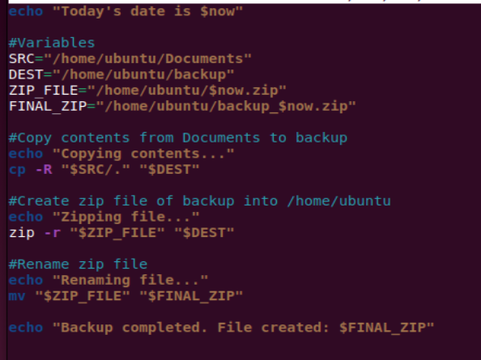

# BRG-27-labs
## Day 1: Setting Up and Exploring Linux
### 1a-1 Virtualisation and Linux Setup
On the first day of class, I was a bit nervous as I've never learned in depth about servers and virtual machines (VM) or even worked with Linux before. I already had a GitHub account prior to class starting. During the introduction Mr. Yatim gave about servers and VMs and how it worked as well as all the buzz words used, I found myself overwhelmed with the sheer number of things I had no knowledge on. Slowly, with more explanation from Mr. Yatim, I was able to understand more about the things he was talking about. Of course, there are still a bunch of things that I will need to read up on and learn but I know that with the resources he had provided, I will be able to gain the knowledge to learn everything I can.

Setting up VMware, VirtualBox and downloading Ubuntu was also a struggle as I kept hitting errors. From being prompted about missing dependencies, to struggling with the downloading of VMware, and the nail in the coffin, unable to run the VM once everything was downloaded. It required me to update my BIOS to enable AMD-V, something I've never done or even heard of. A quick Google search later, I was finally able to run my VM.

### 1a-2 Ubuntu Desktop and Command Line Familiarisation
 I can see that when I write the command `ls`, it is showing just the main files without any hidden files. However, the command `ls -la` shows all the files including the hidden files in the directory. I found out that `-l` actually stands for long format which is why it is showing extra details such as size, modification time etc.

There are some differences I can see while testing `gedit` and `nano`. For `gedit`, it is a graphical text editor that opens up another interface that looked similar to Notepad on Windows while `nano` was entirely done in the terminal itself. Using `gedit` also required me to install a few things to run it such as `gnome-46-2404` and `gedit`.
 gedit: 
 nano: 

Next, I followed the steps to learn how to use the hosts files to add IP addresses into the hosts file. I realised that this would be good for when I frequent these IPs. From the lab, I also learned how to view and edit the different hosts on `/etc/hosts`.  
 

The last thing that I saw a big difference in is when I ran the command `less hello_world.c` and `less hello_world_executable`.  For `hello_world.c`, I can read the actual C source code. It's interesting to see how the computer reads our source code after it has been compiled into binary. I used to think that it's just reading our code, line by line, but I failed to realise that compiling my code would turn it into something totally unreadable by me. 

### 1b-1 Linux Services, SSH, Firewalls & Compression.
#### Apache Web Server
In this lab, I installed Apache2 web server into my VM. I began by updating the package list with `sudo apt update` and then installed Apache using `sudo install apache2`. Once I had installed it, I used `ip a` to find out my IP address so that I can visit it on my local browser which would display the default web page.

Once I have confirmed that it was working, I used the command `sudo nano /var/www/html/index.html` to edit the html so that the web page would look different. Initially, I had forgotten to add `sudo` which resulted in a "Permission denied" error. This is because there is no write access for regular users. Using `sudo` gives me extra permissions thatt I need to modify protected files.

#### UFW
During this activity, I worked with two virtual machines. Using the command `sudo ufw status verbose`, I ensured that the Ubuntu firewall (UFW) was inactive in VM1. When I used `nmap` in VM2 to scan VM1, it listed all the open ports.

However, once I ran `sudo ufw enable` in VM1, I immediately noticed a change in the response given by VM2. It was interesting to see how VM2 could no longer ping VM1 and the nmap scans no longer returned the same port information as it did before. Proving to me that UFW was blocking any requests.

Afterwards, I enabled just port 80 using the command `sudo ufw allow 80/tcp`. This time, when I ran nmap in VM2 again, port 90 appeared as open.

Although I didn't have a lot of trouble in this activity, it was interesting to see how firewalls like UFW operates. At first, with the UFW inactive, my VM2 could easily nmap the first and see all the open ports. Once enabling UFW, the ping stopped working and nmap could no longer detect any of the open ports. This gave me a solid way to test and understand how UFW manages traffic between systems.

#### SSH
In this activity, I continued learning more about SSH(Secure Shell) and how to use it to access into other machines remotely. SSH allows me to log into another computer (in this case VM2) via the command line. I first tried to log into my VM2 using the `ssh 192.168.157.128` command, but it didn't work right away. After troubleshooting, I realised it was because I had activated my UFW which was blocking port 22. Once I disabled the UFW, I was able to successfully establish ssh connection and gain access to my VM2.

The next task was to learn more about user management in Linux. I used the command `less /etc/passwd` to list all user accounts in the system. Before I added a new user, I could see the current ubuntu user that I had set up in my VM2.

By adding a new user with `sudo adduser newuser`, I was able to set up the new account and see how Linux handles new user accounts.

When I used `less /etc/passwd` once more, I noticed a new entry for the user I had created, which confirmed that the account was added properly.

Through these tasks, I got more hands-on experience with managing users and troubleshooting network access via ssh. It also showed me how firewalls can impact remote access and how it is important to configure it correctly.

#### Dealing with compressed archives
In this activity, I worked with compressed archives in Linux, an important skill when managing files on a server. The first task was to download three public domain books from Gutenberg using `wget` command. 

After fetching the files, I used `mkdir books` to create a new books directory before using the `mv` command to move the downloaded files into this directory. Once the files were moved into the new directory, I compressed them using the `tar` command which I had found out meant a `tarball`. Using the options `cf` meant that it was telling `tar` to create a new archive file and to specify the name of the archive file that was to be created. I then tried to use `bzip2` to compress the tarball further but I ran into an issue since `bzip2` wasn't installed. Thankfully, the error message printed made it easier to find out I needed to install in. This taught me that reading and understanding error messages would help guide me to finding a solution even if it was the most straightforward issue.

After installing and compressing the archive into `books.tar.bz2`. Instead of using `ls -la`, I used `ls -lah` as the `-f` flag shows human-readable file sizes, which makes it easier for me to compare the file sizes before and after compression.

Finally, I decompressed the archive using `bunzip2` and extracted the files with `tar -xvf`. It was a simple but useful exercise in understanding how compression and decompression works in Linux by only using the terminal.

### Extension Tasks
#### Challenge 1
>Can you ssh into your neighbour's machine? Once you have logged into your neighbour's machine, see if you can create a text file on their desktop saying Hi_[neighborsname]

I first started by logging into my VM2 by using `ssh [ip_address]`. It prompted me for the password before it allowed me to log in.

And then with a quick command of `touch hi_vm1.txt`, I have successfully created a new text file in my first clone! 

#### Challenge 2
For this challenge, I was successful in launching a `gedit` while ssh'ed into my second VM(VM2). At first, I had assumed that the GUI would appear in VM2. Instead, it was displayed on my VM1 that initiated the ssh session. Although confused at first, I slowly understood what was happening. Even though the program was running on VM2, the GUI window was displayed on VM1 because that was where I was actually working and remotely viewing the session. Basically, I was controlling VM2 remotely but seeing and interacting with it through my own screen which was VM1. 

#### Challenge 3
During this challenge, I attempted to use the `scp` (secure copy) command to transfer a file from my VM1 to my VM2. The command I used was `scp /home/ubuntu/testscp ubuntu@192.168.157.129:/home/ubuntu`. However, I encountered an error:

After researching, I found out that my `/etc/ssh/sshd_config` was missing the line `Subsystem sftp /usr/lib/openssh/sftp-server`. I also learned that `scp`uses `SFTP` (SSH File Transfer Protocol) for file transfer operations. `SSH` provides the secure channel while `SFTP` is the specific protocol that handles the file transfer requests. Therefore, to successfully use `scp`, I need to have both `ssh` and `sftp`.

To fix this issue, I ssh'ed directly into VM2 using `ssh ubuntu@192.168.157.129`. Once I was inside, I could check the ssh daemon configuration by using `sudo nano /etc/ssh/sshd_config` to add in the line `Subsystem sftp /usr/lib/openssh/sftp-server` that would enable the sftp subsystem.

Once I have added the missing line, I restarted the ssh service using `sudo systemctl restart ssh`. This time, I was able to file transfer from VM1 to VM2 without any errors.

#### Challenge 4
Making use of the new found knowledge on `scp`, I created a text file with all the `wget` links for the top ten books on Gutenburg. This makes it easier for me as I don't have to type out the entire link manually. I ran into an issue where they said someone could be eavesdropping - which has happened to me a few times before this. The first time it had happened, it scared me as I genuinely thought I was getting hacked. However, I have come to learn that it just meant that the saved SSH key fingerprint no longer matched the current server's key. Using the command `ssh-keygen -R` helps to remove the old key from my local `known_hosts` file. Once that was done, I was successful with copying the file from my local to my VM.

After successfully downloading all ten books, I made sure to verify that they were all in my directory. I find that it's important for me to double check in my file explorer as it is a visual confirmation that everything went smoothly.

I grouped it all into a directory called `top10`. I used `mkdir` and `mv` to move the downloaded `.txt` files into it. This helps to keep everything organised and also makes it easier to compress everything in one go.

Next, I archived the folder with `tar` and compressed it using `bzip2`. This was a good opportunity for me to practice what I had previously learnt in the previous activities.

For my last step of the challenge, I had to use `scp` to transfer the archive to my VM2. Everything had been going smoothly this whole time and so when I hit my second roadblock for this challenge, I couldn't help but feel a little disappointed. However, I noticed the error message `subsystem request failed on channel 0`, an error message that I had faced before. My first instinct was to go onto my VM2 to check if I had my `ssh` running. Once I verified that it was active, I checked my `/etc/ssh/sshd_config/` to make sure that the sftp subsystem had been enabled as well. Unsurprisingly, it was already enabled as I had added it in during a previous activity. I then figured that it could be the UFW that might be enabled and blocking. However, that too was inactive. 

By now, I knew that it wasn't my ssh, sftp or my ufw. I decided to recheck the syntax of my command, knowing that I could have easily made a mistake there. The command I had wrote was: `scp /top10/top10books.tar.bz2 ubuntu@192.168.157.129:/home/ubuntu`. I didn't see the error at first even as it was staring right at me. To troubleshoot this, I tried to `ls -lh top10/top10books.tar.bz2` and I got `/top10/top10books.tar.bz2: No file or directory`, which got me stressing because I can see the file in my file explorer. Breaking it down into smaller steps, I tried just `ls` and I could see `top10` listed. Then I tried `ls -lh /top10`, same error. That's when I realised that the error was so simple. I should have been using `top10` instead of `/top10` since it was a directory. Shaking my head, I removed the simple yet offending / and it worked instantly.

This activity taught me a lot. It added to my knowledge that I had gained in the previous activities, giving me more confidence in using the commands. However, it also taught me that sometimes the errors could be caused by the smallest things and that I should always check the syntax first.

### 1b-2 Linux File Permissions and Group Access Control
Before starting this activity, I only understood file permissions in Linux on a suface level. I didn't realize just how important group ownership and permission structure could be but this activity gave me hands-on experience managing access between multiple users.

I started by creating three users: Alice, Bob, and Mallory using `sudo adduser`.

Next, I created a `shared` directory in `/home` and used `touch` to create the ten blank files and listed them with `ls -l` to confirm that they were created successfully.

I then created a group called `awesomegroup` and added Alice and Bob to it using `usermod`. The reason why I didn't add Mallory to the group was because I didn't want her to have any access to the `shared` directory.

At first, Alice was not able to access the directory or create any files. I realised that it was because I hadn't changed ownership to her and that the root was still the owner of the directory. I used `chown -R alice:awesomegroup /home/shared` to change the owner to Alice and the group to `awesomegroup`. I then set the correct permissions with `chmod -R 750`, which meant that the owner of the group (Alice) would be able to read, write and execute, the group members (Bob) would be able to read and execute, and the others (Mallory) wouldn't be able to do any of those.

With the correct permissions set, I had to check it. I logged into Alice's account with `su - alice -s /bin/bash/` to check. Thankfully, Alice was able to `cd` into the folder, view the files and she was even able to `touch` a new file called `testfile`. Originally when I first tried this activity, I had left the ownership to `ubuntu:ubuntu` which meant that Alice didn't have the permissions she was supposed to have. I had to restart this activity multiple times before I was finally able to get Alice the correct permissions she was supposed to have.

After testing Alice, I went on to test if Bob had the correct permissions. As expected, he could read and execute files but couldn't create anything new in the folder as he did not have the write permission given to him.

Since Mallory wasn't in the group, she couldn't even `cd` into the directory, which was the expected behaviour since non-group members did not have any permissions given to them.

One of the biggest issues I face during this activity was working in the wrong path. I kept creating files inside of `/home/ubuntu` instead of `/home` which caused a lot of confusion as the directory or files couldn't be found when I was switching between the different users to check their permissions. Creating sucha small but fatal mistake at the very start, forced me to restart the activity multiple times.

#### Challenge
For this challenge, I added Mallory to the `sudoers` group. Once she was added, she was able to run all the commands to read, write and execute in the shared directory despite the fact that her normal access was blocked. 

## Day 2: Services, Cost, and Scripting

### 2a-1 Total Cost of Ownership (TCO) Analysis.
Before this lab activity, I wasn't fully aware about the concept of Total Cost of Ownership (TCO). This activity showed me how important it is to factor in long-term expenses like consumables, electricity, and maintenance.

I compared two printers: the Canon PIXMA MG3620 (inkjet) for the budget, home use and the Brother DCP-L2640DW (laser) which is more suitable for office use. The Canon printer was cheaper to buy initially `($119 vs $278)`, but it had a much higher TCO - `$77,353` over 5 years. This is due to the low-yield ink cartridges which was the true bulk of the price. The total price on just ink cartridges alone would be `$69,350`.

In comparison, while more expensive in the initial stage, the Brother had a TCO of just `$17,042` and it is all thanks to the more efficient toner and drum system. The toner itself had a yield of 3000-pages compared to the low yield of 180-pages and 400-pages for the black ink and color cartridges respectively. Over the 5 year period with an estimate of 180,000 pages, the Brother prints each page at a meagre price of `$0.09` while the Canon is `$0.43`. Thanks to the toner and drum system, there is a total savings of `$60,311`.

This exercise helped me to see how misleading low upfront costs can be and how essential it is to calculate long-term costs especially when it comes to making IT procurement decisions. While the Canon printer seems cheaper at the beginning, it ends up being over four times more expensive in the long run due to its inefficient ink system.

### 2b-1 Cloud Web Server Deployment with Amazon EC2

#### Challenge 1
For this challenge, I ran a quick test using the command `ping [website]` on a few websites to check their latency:  google.com, gov.sg, bbc.co.uk, sydney.edu.au, mit.edu, japan.go.jp. I chose these because I wanted to see how the physical distance between where I am  (Singapore) and where their websites' servers are likely located will affect how fast they respond.

As expected, the fastest connections were from Singapore and Japan. Google was also really fast as they have servers in Singapore. The slowest turned out to be from sydney.edu.au, which was expected due to the physical distance from Singapore. 

However, I was actually surprised to see how quickly bbc.co.uk and mit.edu responded. I was expecting it to have a similar latency to sydney.edu.au since they are even further away. So I did a quick search and found out that for bbc.co.uk, they are actually making use of Content Deliveray Networks (CDNs), which helps to speed up content delivery, reduces load times and improves website performances. From my search, I learnt that CDNs stores copies of website contents on servers all around the world so that users can connect to a server that's near to them.

#### Challenge 2
For this challenge, I made use of Amazon EC2 to launch a new virtual machine in the cloud. It took a bit of tinkering around and searching around for help to get it up and running. I found that I was less overwhelmed than I was yesterday as I had picked up some of the keywords and concepts. Of course, there are still a lot more for me to learn when it comes to VM and cloud services but I'm confident that with time and more hands-on experience, I'll be able to build a more solid foundation that would help me during my time in Kaplan.

Once I had the EC2 instance running, I connected to it from my local using PowerShell via `ssh`. I did the necessary steps such as installing Apache2 and moved on to editing the index.html so that I could ensure my page was unique and that it was working. To do that, I used the command `sudo nano /var/www/html/index.html`.

At the start of this challenge, I was facing troubles as I was going about it all wrong. Since the file that I wanted to transfer into the VM is in my local folder, I was supposed to be using the local machine to run the `scp` command. However, I was trying to run the command in the VM itself which did not work as they couldn't find the file I was asking it to find. After a few failed attempts and reading through from forums, I realised that I needed to run the `scp` command from my local machine and not the VM. Once I did that, I was finally able to successfully transfer the file from local into the cloud instance. 

After succesfully transferring it into the VM, I was then stumped once again when I couldn't see the file that I've transferred. I had to look back at the steps provided in the challenge to see if there was a step that I had missed or maybe a command that I could use again. That's when I realised that I had to do one more step of moving the file into `/var/www/html/`. Once it was moved into the correct location, I was then able to edit the `index.html` and add a link to that file.

This experience was definitely challenging but I found it super rewarding. It forced me to troubleshoot, search for solutions, and really build my understanding of what is happening behind the scenes.

### 2b-2 Introduction to Bash Scripting & System Automation
For this lab, it was truly a hands-on experience with Bash scripting. Although, I had prior experience with Bash, it had been a while since I used it and this lab helped to refresh my memory and build a stronger foundation on it.

I first started by making a new folder called LabFiles by using the command `mkdir LabFiles`. Once I had `cd` into that folder, I made a new file and used `echo` to write content in that file. Since I used the redirect `>` command, it writes the text directly into the file instead of printing the words on my terminal. This is another way that I can change the content in a file instead of using the `nano` command which opens up a text editor.

After that, I moved on to the next part. I created `hello_world.sh` and in the first line I added the line `#!/bin/bash`. After searching what it stands for online, I learnt that it is called a `shebang` or `hashbang` line. It tells the system to run the script using the Bash shell. I used `chmod 777` to make the  script executable. This command sets the permissions for everyone to be able to read, write, and execute the file. For security reasons, it is often not recommended. `chmod +x` however, only changes the execute permission for the file. It does not change any existing read or write permissions. Once I had changed the permission, I was able to run the file. I did face a small issue but after editing my file, I was able to get it to print out the words `Hello, World!` properly.

Afterwards, I moved on to the move advance scripting portion of the lab. I first started with creating a `system_info.sh` file and proceeded to add in the code. It had a `for` loop that displays the five countdowns, a `read` to read user input and `if, elif, and else` statements to print different things based on the user's input. There was also a regex to validate if the user's input was a numeric value or not.

This showed me how scripts can be used to be interactive and to respond dynamically to different inputs. I also began to understand the importance of input validation, especially in real-world scripts that others would use.

The final part of the lab, I worked on a system monitoring script called `resource_monitor.sh`, which automates checking system resource usage. The script runs a loop based on the user input and displays information about the CPU, memory, and disk usage. It showed live system data by using the commands:
- `top -b -n1 | grep "Cpu(s)"`: for CPU usage
- `free -h`: for memory usage
- `df -h | grep "^/dev"`: for disk usage

This part of the script showed me how automation can be used to simplify monitoring tasks that could get mundane over time. Instead of manually running and using multiple commands, this script runs them all at once and displays it like a snapshot which can be very useful for admins or users who are managing servers. There are different ways I can see Bash scripting helping me in my future tasks. For example:
- `Automated Backups`: I could write a script to compress and copy important files weekly.
- `Scheduled system cleanups`: Automatically removing old temp files or freeing up disk space.

## Day 3: DNS, Certificates, and Automation

For today's lab activities, it was all about securing our web server with HTTPS using a free SSL certificate that I obtained from Let's Encrypt. Having a proper domain name with the secure padlock beside it made it feel legit. That is because I went from typing in the IP address of the server to a real website and url that was also secured.

#### 3a-1 Domain, DNS and TLS Certificates

Before I started working on getting the SSL certificate and turning my HTTP into HTTPS, I had to sort out the domain name. The few options listed in the lab required me to pay or input my credit card. Unwilling to do so, I sourced out other options I could use. At first I tried the Freenom and Dot.tk - but they kept throwing errors or just wouldn't load at all. I also tried applying for a GitHub Student Developer Pack as it provides free domain for up to a year, but that needed to be verified first. Eventually, I decided to go with DuckDNS, which was very simple to set up. I created the domain `iseabrdg.duckdns.org` and updated the IP address to point to my EC2 instance.

One small issue I ran into was that when I tried to open the domain in the browser, it didn't load immediately. I instantly thought that I had made a mistake. To double confirm that the domain was working, I used the `curl` command `(curl iseabrdg.duckdns.org)` as well as to `nslookup iseabrdg.duckdns.org` to confirm that the site was actually reachable. After a minute or two of constant reloading, to my relief the website started working. 

#### 3a-2 Enabling HTTPS with Let's Encrypt & Certbot

Once I had the domain pointing to my server and confirmed that it was accessible and running, I installed Certbot using the command `sudo apt install certbot python3-certbot-apache -y`. Once it was installed, I ran the command `sudo certbot --apache -d iseabrdg.duckdns.org`. The process of getting the SSL certificate was very smooth. It asked me a few questions and immediately after that, it had successfully deployed a certificate for my domain. I refreshed the page in my browser and was pleased to see that my domain had a padlock icon next to the URL which meant that the HTTPS certificate was live.

I also ran a dry-run renewal test using the command `sudo certbot renew --dry-run` just to see how the auto-renewal would work if I ever wanted to renew the SSL certificate.

From this lab activity, I have learnt that HTTPS is a must-have in this time and age, even for the most basic websites. Having your domain secured builds trust in the users that would use your website. I also enjoyed being able to use Let's Encrypt as it made obtaining SSL certificates super accessible. It is nice that it is free and renews automatically. I also learnt that having proper set up for both my EC2 and my DNS was crucial as it caused a small delay in my lab activities. With more hands-on work, I know it will be like second nature to me once I build more confidence. 

I can see myself using this setup again if I ever deployed a portfolio or a web project. Currently, all of my projects and portfolio are using Netlify or GitHub Pages. It would be nice to have my own domain and having it SSL certified. 

#### 3b-1 Bash Backup Scripting, Cron Jobs & Cloud Export

This was by far the most frustrating and hardest activity in this module. Before this activity, I only had a surface level understanding of Bash scripting and nothing at all about cron jobs. Although I knew that it was possible to automate tasks in Linux, I never really had the chance to explore it. This activity helped me see how scripting, automation and remote file transfer can all work together in a practical system especially when it comes to backups. Even though I struggled a lot, I felt really proud being able to build a system from scratch that could run on it's own and even survive a reboot.

I started with a simple `helloworld.sh` that had a `for` loop inside to `echo $i` from 0 to 9. From there, I modified the code to calculate to calculate the sum of numbers from 0 to 9 and echo the results.

I moved on to setting up the directory structure. In `/home/ubuntu/Documents`, I created five empty files and created a folder called `testfolder` that contained five more files. This part wasn't hard since I had accumulated the knowledge and confidence from the previous activities in the module. 

Then I began building the backup script called `testscript.sh` using `nano`. The goal for this part of the lab was to archive the files into a zip file and timepstamp it. I started by defining a variable called `now` with the current date using `now=$(date+"%d_%m_%y")`. I immediately ran into an error where the date command was 'not found'. After troubleshooting, I realised the issue was because I had forgotten to put a space between `date` and the `+` sign. It was a small but critical syntax issue that had caused the failure. 

Once I had fixed that, I tested the script once more and saw that `.zip` file was created. But when I when to check it, it was empty. I also noticed in the terminal that it wasn't adding any files into the zip file. It was a confusing issue that I had to ask Mr. Yatim for help. He pointed out that it was because I was using `/home/ubuntu/Documents/*` instead of `/home/ubuntu/Documents/.`. Again, such a small syntax error caused another failure that would have been a big issue if it wasn't caught.

I also faced an issure with the `zip` command itself. This was because I hadn't installed it onto my VM. I had falsely assumed that it was there. After running `sudo apt installed zip`, the script was finally able to compress the folder correctly.

After that, I took my time to enhance the script by adding more variables such as `SRC`, `DEST`, `ZIPFILE` and `FINAL_ZIP`. I did this so that the code could be scalable in the event that I needed to change the source folder or backup location. It would make it easier for me to change one thing than to go through the code and change every instance of it.

I then made the script globally accessible by moving it to `/usr/bin` and tested it using just `testscript` from anywhere in the terminal. I then set up a cron job using `sudo crontab -e` to run the script every hour. For testing purposes, I had scheduled it to run every minute just to make sure that the automation was working correctly.

The next step was to export the backup to a remote cloud server using `scp`. I had to first `scp` the `webserver-key.pem` file from my local into the VM. Once I had that, I connected into my EC2 instance to backup the file into it. I tested it and it was successful. 

The most frustrating challenge was gettign the backup script to run after reboot. Every time I rebooted my VM, it would reset everything and delete my files and scripts. I eventually realized it was because I hadn't properly installed Ubuntu on the virtual hard disk and that I was actually booting into a new live session each time I powered on my VM. After installing and configuring the VM properly and three failed attempts later, I tested the `@reboot` cron job and it finally worked as expected. 

To finish up this lab, I installed figlet and neofetch to personalize the terminal. Now, every time I launched a session, there is a welcome greeting.

Overall, this was one of the most practical labs so far. It tied everything together from scripting, automation, system config and networking in a way that made me feel more in control and confident in working on a Linux environment. It hadn't been a smooth journey but with every roadblock, it taught me something that I would definitely use again in the future. In fact, I had started using `scp` a lot in my workplace when I have to transfer files between my local and my VM.